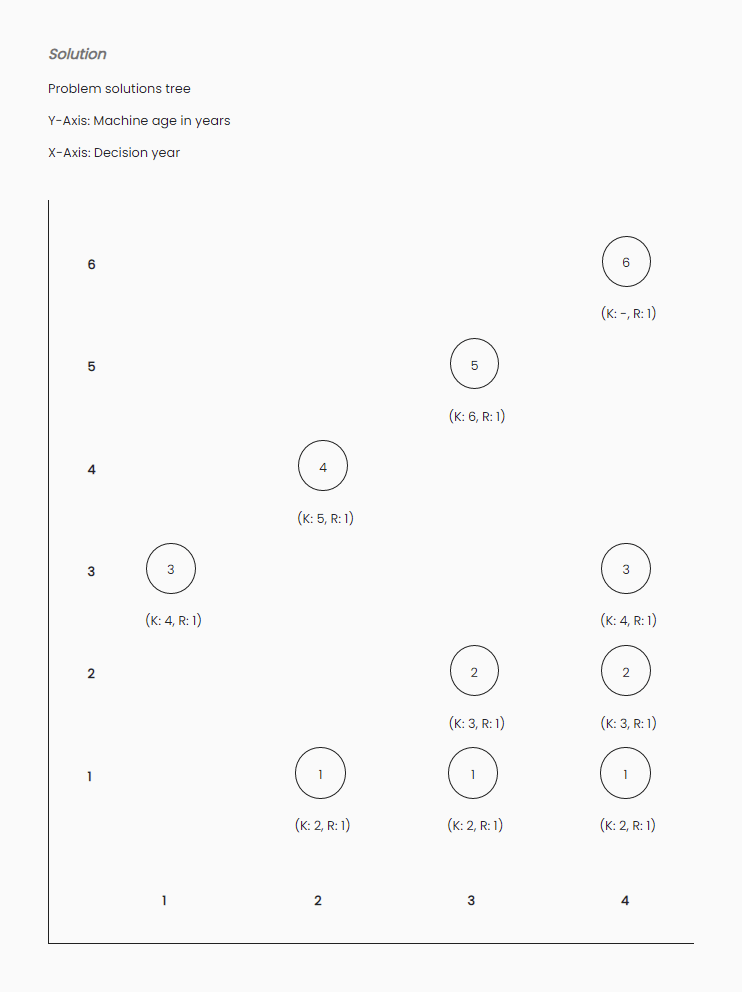
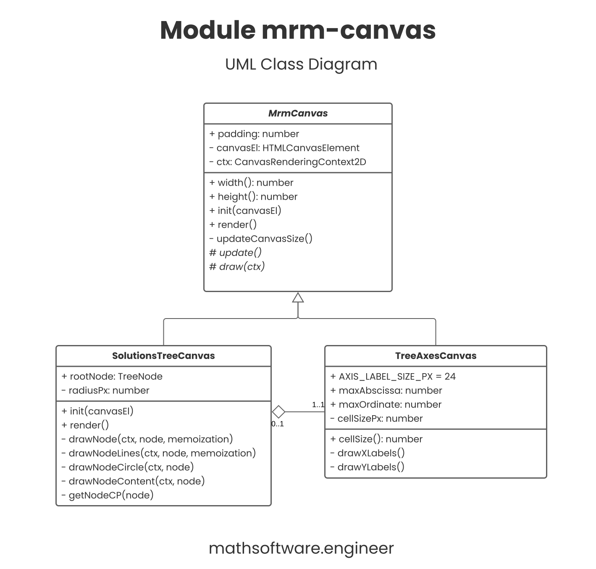
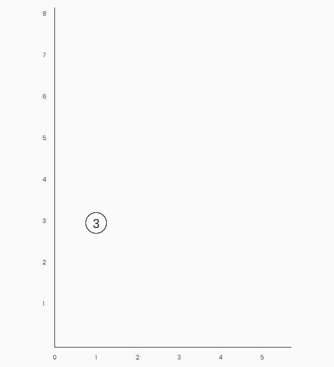
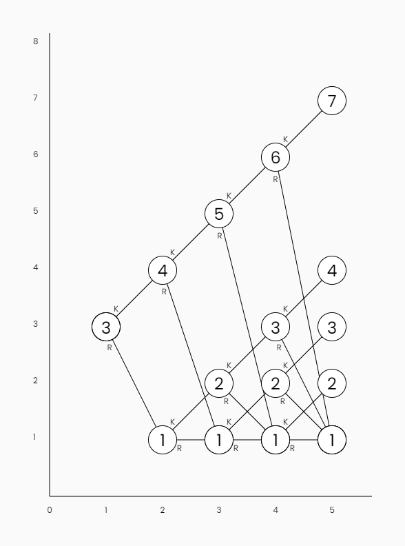
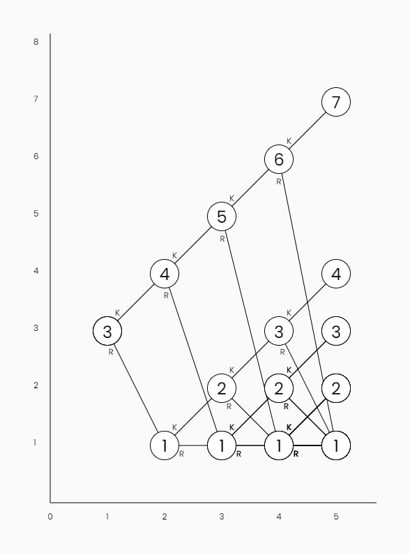
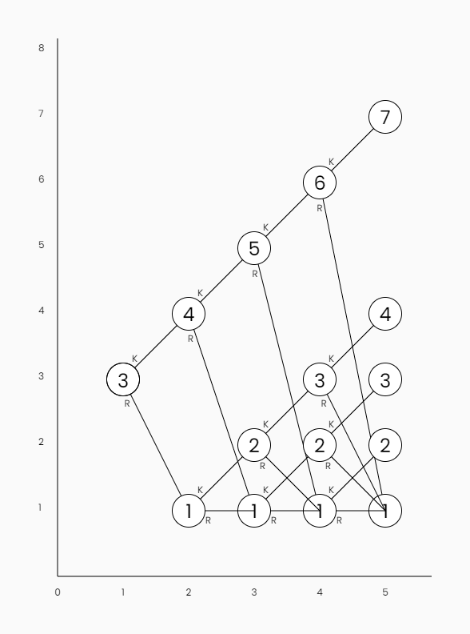
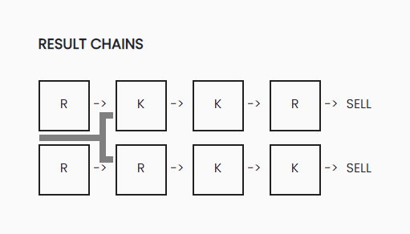
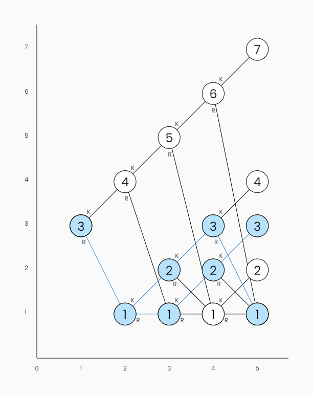

<!-- Copyright (c) 2022 Tobias Briones. All rights reserved. -->
<!-- SPDX-License-Identifier: CC-BY-4.0 -->
<!-- This file is part of https://github.com/mathsoftware/engineer -->

# Drawing a Tree on Canvas with XY Coordinates

A detailed design, development, and recursion analysis to draw a tree data
structure with HTML Canvas and TypeScript are given from the solutions' tree
feature implemented into the 2DP Repsymo Solver for the machine replacement
model from the operations research field.

## Original MRM Problem

The **Machine Replacement Model (MRM)** is a deterministic dynamic programming
model from operations research. It states that we have a machine with an
initial age. We have a number of decision years to know what to do with that
machine. Then, for each decision year, there are two options: **keep** the
machine and pay maintenance (**K**), or **replace** the machine with a new one
(**R**). All the possible outcomes starting from the first decision year can be
visually represented as a tree that grows on the horizontal axis or the same, 
the independent variable (decision year).

The first solutions' tree version depicted below was made with HTML, CSS, and
the DOM API (`div` elements). That version can be found at
[EP: MRM](https://github.com/tobiasbriones/machine-replacement-model---ep)[^1].
It's recommended to check it out to understand the problem better and get
textbook references. It's also advisable to review the
[Repsymo Solver](https://repsymo.com) for a complete insight into this model
(and more).

[^1]: **Example Project: Machine Replacement Model** was the first and
    main OR project devised and developed by
    [Tobias Briones](https://github.com/tobiasbriones) to solve and be able
    to explain the MRM to eventually end up building the 2DP Repsymo Solver



Chances are obviously limited and the connecting lines from a node to 
its next nodes are missing (hence the pairs $$(K, R)$$ as labels). The other 
problem is that the data structure was a **two-dimensional array** but the 
underlying model corresponds to a **tree**. This solution was a very good fit 
back in the day for moving forward faster with the development.

The problem consists of **populating the binary tree data structure onto a
canvas and also the XY-axes** to establish each node's position.

A browser canvas[^2] (or canvas in general) is not the best performant
solution[^3] but is a great step for this problem in terms of rendering and
correctness.

[^2]: A Canvas is a popular, more flexible, and performant tool for specific
    graphics than a user GUI library like for example the HTML DOM API or
    Android Views, but it's a lower-level API, so it requires more work and
    design which is probably what we're looking for

[^3]: A Canvas is a lower-level tool than a GUI toolkit, but it's far from
    the advanced top-performant techniques

### Other Kinds of Trees

Another more common tree data structure is a file explorer which loads your
directories and files from your disk. For working with trees we natively
implement recursion as the natural or mathematical definition of the problem.
Here is another project showing some recursion and designed to work with file
systems
[CP: Distributed Text File System](https://github.com/tobiasbriones/distributed-text-file-system---cp)
where its left panel with a populated-root-directory is also a tree.

### Tree Data Structure

As said above, the nature of many problems is recursive.

There are many ways of representing trees, and one of them is the underlying 
topic of this article: the solutions' tree of the MRM. Others are file
systems, and so on.

When a wrong data structure is applied (due to engineering constraints) like
two-dimensional arrays (cartesian coordinates) to model what actually is a
tree (recursive) in this case, algorithms arise, and they're limited, 
convoluted, and prone to errors.

Applying the right data structure to a model has more engineering efforts,
but it homogenizes the problem down to a simple model that is elegant and
correct, in other words, the model **matches**[^4] the representation.

[^4]: Notice FP pattern matching

## Development

Two elements are required to draw on the canvas, namely, the 2D-Axis and the
tree that grows horizontally.

### Getting Started

Create into your HTML a `div` containing the `canvas` in which we are going to
draw.

```html
<div id="solutionsTreeParent">
  <canvas id="solutionsTree"></canvas>
</div>
```

Some styles can be added.

```css
#solutionsTreeParent {
  width: 100%;
  height: 720px;
  overflow-x: auto;
}
```

Now everything will be programmatically developed.

Create the module `mrm-canvas` that is going to be developed. It's going to
contain the following specification that is going to be detailed along with this
article:



This function is going to help with some calculations:

```ts
function getHypotenuse(triangleX: number, triangleY: number) {
  return Math.sqrt(Math.pow(triangleX, 2) + Math.pow(triangleY, 2));
}
```

#### Resources

- [root-node.json](web/static/root-node.json): sample tree object to render.
- [model.ts](web/src/model.ts): assumed data model.
- [mrm-canvas.ts](web/src/mrm-canvas.ts): underlying module.
- [gh-pr](https://github.com/repsymo/2dp-repsymo-solver/pull/21): pull request
  containing the initial step-by-step development.

##### Other Resources

- [triangle.py](triangle.py): generates the rectangle triangles figure.

### Tree Model

The solutions' tree for the machine replacement model consists of the following
data type:

```ts
interface TreeNode {
  machineAge: number;
  decisionYear: number;
  k?: TreeNode;
  r?: TreeNode;
}
```

It follows that the independent variable $$x$$ is going to be the `decisionYear`
attribute and the dependent variable $$y$$ the `machineAge`. The tree is binary
so can have two children: `k` and `r`.

Thus, we have a binary tree to draw on an $$XY-plane$$.

This data structure is an external given model, so it should be added, say, 
into a `model.ts` module.

### Canvas Design

The following base class is going to manage the canvases. It has the
`HTMLCanvasElement` (with its respective context) member so the drawing is
performed on that canvas element. The init method sets the canvas element and
its size according to its parent element. The render method runs a standard game
loop operation when the model is updated and then the drawing is performed with
the new model values computed. That means the tree can be re-rendered in
different states if the `render` method is called.

```ts
abstract class MrmCanvas {
  public padding: number;
  private canvasEl: HTMLCanvasElement;
  private ctx: CanvasRenderingContext2D;

  protected constructor() {
    this.padding = 0;
  }

  get width() {
    return this.canvasEl.width;
  }

  get height() {
    return this.canvasEl.height;
  }

  init(canvasEl: HTMLCanvasElement) {
    this.canvasEl = canvasEl;
    this.ctx = this.canvasEl.getContext('2d');
    this.updateCanvasSize();
    this.update();
  }

  render() {
    this.update();
    this.draw(this.ctx);
  }

  private updateCanvasSize() {
    const parentEl = document.getElementById(parentElId);
    this.canvasEl.width = parentEl.offsetWidth - this.padding;
    this.canvasEl.height = parentEl.offsetHeight - this.padding;
  }

  protected abstract update();

  protected abstract draw(ctx: CanvasRenderingContext2D);
}
```

### Drawing the Axes

First, the axes lines are easily drawn:

```ts
ctx.font = '12px Poppins';
ctx.fillStyle = 'black';

ctx.moveTo(this.padding, 0);
ctx.lineTo(this.padding, this.height - this.padding);
ctx.lineTo(this.width, this.height - this.padding);
ctx.lineWidth = 1;
ctx.stroke();
```

To draw the $$X$$ axis labels, set the text-align center and draw the abscissa
value from $$0$$$ until a maximum set value. There is a variable `cellSizePx`
that tells the width and height of each cell in the $$XY-plane$$$ (first
quadrant).

```ts
ctx.textAlign = 'center';

for (let i = 0; i <= this.maxAbscissa; i++) {
  const x = (i * this.cellSizePx) + this.padding;
  ctx.fillText(String(i), x, this.height);
}
```

For drawing the $$Y$$ axis labels some minor considerations are taken into
account to draw it properly.

```ts
ctx.textAlign = 'start';

for (let i = 1; i <= this.maxOrdinate; i++) {
  const y = this.height - (i * this.cellSizePx) - this.padding;
  ctx.fillText(String(i), 0, y);
}
```

These results are compiled into the `TreeAxesCanvas` class:

```ts
class TreeAxesCanvas extends MrmCanvas {
  public static readonly AXIS_LABEL_SIZE_PX = 24;
  public maxAbscissa: number;
  public maxOrdinate: number;
  private cellSizePx: number;

  constructor() {
    super();
    this.padding = TreeAxesCanvas.AXIS_LABEL_SIZE_PX;
    this.maxAbscissa = 5;
    this.maxOrdinate = 8;
  }

  get cellSize() {
    return this.cellSizePx;
  }

  protected update() {
    this.cellSizePx = this.width / 6;
  }

  protected draw(ctx) {
    ctx.font = '12px Poppins';
    ctx.fillStyle = 'black';

    ctx.moveTo(this.padding, 0);
    ctx.lineTo(this.padding, this.height - this.padding);
    ctx.lineTo(this.width, this.height - this.padding);
    ctx.lineWidth = 1;
    ctx.stroke();
    this.drawXLabels(ctx);
    this.drawYLabels(ctx);
  }

  private drawXLabels(ctx) {
    ctx.textAlign = 'center';

    for (let i = 0; i <= this.maxAbscissa; i++) {
      const x = (i * this.cellSizePx) + this.padding;
      ctx.fillText(String(i), x, this.height);
    }
  }

  private drawYLabels(ctx) {
    ctx.textAlign = 'start';

    for (let i = 1; i <= this.maxOrdinate; i++) {
      const y = this.height - (i * this.cellSizePx) - this.padding;
      ctx.fillText(String(i), 0, y);
    }
  }
}
```

Then

```ts
const canvasEl = document.getElementById('solutionsTree') as HTMLCanvasElement;
const axesCanvas = new TreeAxesCanvas();

axesCanvas.init(canvasEl);
axesCanvas.render();
```


### Drawing the Tree

The tree canvas is quite more complicated. The class consists of the following
structure:

```ts
class SolutionsTreeCanvas extends MrmCanvas {
  private readonly axesCanvas: TreeAxesCanvas;
  public rootNode: TreeNode;
  private radiusPx: number;

  constructor() {
    super();
    this.axesCanvas = new TreeAxesCanvas();
    this.rootNode = newTreeNode();
  }

  init(canvasEl) {
    super.init(canvasEl);
    this.axesCanvas.init(canvasEl);
  }

  render() {
    super.render();
    this.axesCanvas.render();
  }

  protected update() {
    this.radiusPx = this.axesCanvas.cellSize / 4;
  }

  protected draw(ctx) {
    const memoization = new Set<string>();

    this.drawNode(ctx, this.rootNode, memoization);
  }

  private drawNode(ctx: CanvasRenderingContext2D, node: TreeNode, memoization: Set<string>) {/* ... */}

  private drawNodeLines(ctx: CanvasRenderingContext2D, node: TreeNode, memoization: Set<string>) {/* ... */}

  private drawNodeCircle(ctx: CanvasRenderingContext2D, node: TreeNode) {/* ... */}

  private drawNodeContent(ctx: CanvasRenderingContext2D, node: TreeNode) {/* ... */}

  private getNodeCP(node: TreeNode) {/* ... */}
}
```

Notice we have:

- **An axes canvas:** To draw the axes.
- **The root node:** The tree data structure that is going to be drawn.
- **A radius:** A computed value for a node's radius.
- **Memoization:** To avoid drawing nodes that have already been drawn due to
  the recursive algorithm.

Finally, yes, the `drawNode` method is going to be the recursive function. You
can start noticing it is called to draw the root node, so it ends up drawing all
the children recursively.

Regarding the helper method `getNodeCP` we have the following code to get the
center point of the given `node`:

```ts
const cp = {
  x: (node.decisionYear * this.axesCanvas.cellSize) + TreeAxesCanvas.AXIS_LABEL_SIZE_PX,
  y: this.height - (node.machineAge * this.axesCanvas.cellSize) - TreeAxesCanvas.AXIS_LABEL_SIZE_PX
}
```

#### Drawing a Node (`drawNode`)

This is the recursive function to populate the whole tree from the root node. We
take care of memoization to dynamically store the drawn nodes. For correctness
effects we always render the node circle and its content but the node lines and
labels (which are visually significant if rendered more than once) are only
rendered once.

```ts
const point2d = { x: node.decisionYear, y: node.machineAge };
const point2dStr = JSON.stringify(point2d);
const hasNeverBeenDrawn = !memoization.has(point2dStr);

if (hasNeverBeenDrawn) {
  this.drawNodeLines(ctx, node, memoization);
}
this.drawNodeCircle(ctx, node);
this.drawNodeContent(ctx, node);
memoization.add(point2dStr);
```

So, it takes three steps:

- Draw the outgoing lines with their corresponding labels.
- Draw the circle with background and border.
- Draw the node content consisting of its `machineAge` (y-coordinate) attribute.

The method `drawNodeLines` calls back to this method so initiates the recursion
process. That one is left to the end as it's the harder.

#### Node Circle and Content (`drawNodeCircle` and `drawNodeContent`)

These are pretty straightforward.

To draw the circle:

```ts
const { x, y } = this.getNodeCP(node);
ctx.beginPath();
ctx.arc(x, y, this.radiusPx, 0, 2 * Math.PI);
ctx.fillStyle = 'white';
ctx.fill();
ctx.stroke();
```

To draw the content inside the node:

```ts
ctx.font = '24px Poppins';
ctx.textAlign = 'center';
ctx.fillStyle = 'black';
const txt = String(node.machineAge);
const txtMetrics = ctx.measureText(txt);
const txtHeight = txtMetrics.actualBoundingBoxAscent + txtMetrics.actualBoundingBoxDescent;
const { x, y } = this.getNodeCP(node);
ctx.fillText(txt, x, y + txtHeight / 2);
```

Notice in the call to `measureText`, we use an advanced Canvas API to get the
text height and be able to center it vertically. It is horizontally centered
with `ctx.textAlign = 'center'`.

By running at this stage we obtain the first node drawn representing the initial
decision year:

```ts
const canvasEl = document.getElementById('solutionsTree') as HTMLCanvasElement;
const canvas = new SolutionsTreeCanvas();
canvas.rootNode = this.solver.getSolutionsTree(); // Use your tree here

canvas.init(canvasEl);
canvas.render();
```



#### Line with Labels from Node-to-Node (`drawNodeLines`)

First, we need some definitions to address this challenge:

```ts
const padding = TreeAxesCanvas.AXIS_LABEL_SIZE_PX;
const { x, y } = this.getNodeCP(node);
const isNodeNext = (next: TreeNode) => node.machineAge === 1 && next.machineAge === 1;
const isNodeBelow = (next: TreeNode) => node.machineAge < next.machineAge;
```

The $$(x, y)$$ coordinates are the center of the node (Center Point). The arrows
tell us if the next node is just to the right of the current node
(iff both nodes' ordinates are the same and equal to $$1$$ for this problem).

Drawing the line is straightforward:

```ts
const nextX = (next.decisionYear * this.axesCanvas.cellSize) + padding;
const nextY = this.height - (next.machineAge * this.axesCanvas.cellSize) - padding;
ctx.beginPath();
ctx.moveTo(x, y);
ctx.lineTo(nextX, nextY);
ctx.stroke();
```

The rectangle triangle defined by the two-node points is going to be useful for
computing the directions for the outgoing lines from the current node to the
next one. We simply use similar triangles to obtain the requesting points.


```ts
const triangle = (next: TreeNode) => {
  const nextCP = this.getNodeCP(next);
  const nextX = nextCP.x;
  const nextY = nextCP.y;
  const triangleX = nextX - x;
  const triangleY = Math.abs(nextY - y);
  const hypotenuse = getHypotenuse(triangleX, triangleY);
  return { triangleX, triangleY, hypotenuse };
};
```

With that information we can draw the lines according to the corresponding
quadrant: up, straight or right, down. The next node is always to the right as
the decision year always increases.

```ts
const drawUpRightLabel = (next: TreeNode, label: string) => {
  const { triangleX, triangleY, hypotenuse } = triangle(next);
  const labelX = x + (triangleX * this.radiusPx / hypotenuse);
  const labelY = y - (triangleY * this.radiusPx / hypotenuse) - 8;
  ctx.fillText(label, labelX, labelY);
};

const drawDownRightLabel = (next: TreeNode, label: string) => {
  const { triangleX, triangleY, hypotenuse } = triangle(next);
  const labelX = x + (triangleX * this.radiusPx / hypotenuse) - 4;
  const labelY = y + (triangleY * this.radiusPx / hypotenuse) + 16;
  ctx.fillText(label, labelX, labelY);
};

const drawRightLabel = (next: TreeNode, label: string) => {
  const { triangleX, triangleY, hypotenuse } = triangle(next);
  const labelX = x + (triangleX * this.radiusPx / hypotenuse) + 4;
  const labelY = y + (triangleY * this.radiusPx / hypotenuse) + 16;
  ctx.fillText(label, labelX, labelY);
};
```

Then just call one of these functions to draw the appropriate line:

```ts
const drawLabelTo = (next: TreeNode, label: string) => {
  ctx.font = '12px Poppins';
  ctx.textAlign = 'center';
  ctx.fillStyle = 'black';

  if (isNodeBelow(next)) {
    drawUpRightLabel(next, label);
  }
  else if (isNodeNext(next)) {
    drawRightLabel(next, label);
  }
  else {
    drawDownRightLabel(next, label);
  }
};
```

Finally, to implement the method `drawNodeLines` we draw the line to the
"Keep" node and to the "Replace" node making use of recursion:

```ts
if (node.k) {
  drawLineTo(node.k);
  drawLabelTo(node.k, 'K');
  this.drawNode(ctx, node.k, memoization); // Recursive call
}
if (node.r) {
  drawLineTo(node.r);
  drawLabelTo(node.r, 'R');
  this.drawNode(ctx, node.r, memoization); // Recursive call
}
```

The initial method `drawNode` is called recursively (recall that `drawNode` was
the caller and `drawNodeLines` is the callee) and the `memoization`
set is carried to the method call.

### Enhancing Rendering Sizes

For managing more proper rendering sizes
[this may be an idea](https://github.com/repsymo/2dp-repsymo-solver/pull/22).

Another option is to call the method `init` on window size changed, adding
scroll, etc. Performance should be considered here.

### Result

By importing the developed module, the API is then consumed as follows:

```ts
const canvasEl = document.getElementById('solutionsTree') as HTMLCanvasElement;
const canvas = new SolutionsTreeCanvas();
const tree = this.solver.getSolutionsTree(); // Replace with your tree

canvas.rootNode = tree;
canvas.init(canvasEl);

canvas.render();
```

By running now, we get the desired result:



### Analysis

Analysis on correctness and performance is detailed.

#### Memoization

If we remove the memoization, nodes will be rendered more than once which is not
accepted. The results are shown below. Recall that we still render the node
circle and content to fix incorrectness but the lines and labels must not be
drawn more than once. Excluding the lines (and labels) drawing is partial
drawing, so we only draw the circle and content.

The tree is binary containing $$15$$ nodes.

| Technique                                     | Rendering Times |
|-----------------------------------------------|-----------------|
| With Memoization (partial drawings)           | 15              |
| With Memoization (whole and partial drawings) | 21              |
| Without Memoization                           | 31              |

Hence, the `drawNode` function is called $$21$$ times to render the whole 
tree but just $$15$$ of those are full rendering.

With memoization off is visually clear that nodes are being rendered on top of
themselves, so it's easy to stop that flaw:



The problem, if we use full memoization, is as said before, correctness:



The optimization can be addressed by computing a more accurate model and just
drawing the exact required line tangent to the nodes, so they don't overlap with
the other content.

#### Order of Rendering

By counting the time a node was drawn with full memoization and drawing it on
top of the node in blue we can easily debug or follow the recursion process.
Recall that, as said above, the last nodes from the bottom are partially drawn
more times later.


### More Recursion

From the equipment replacement problem, we have a solution that tells you what
to do with the machine or equipment from the first decision year
(result chains). For a given year, it might turn out that both solutions, keep
or replace, yield the exact same effect, hence we have a bifurcation:
we have to follow two branches, if we keep and if we replace. This produces a
directed graph structure that looks similar to the tree that was developed.

**Result Chains:** Replace the first year and then, two ways can be taken for
the next year.



Since the solutions' tree is the set of all possible solutions to the problem,
and particularly, the problem-solution belongs to the three which, with more
clever work can be traced onto the same solutions' tree:

**Traced Solutions Tree:** The model solution can be drawn into the tree.



Check out
[Pull Request: Implement solution tracing on mrm solutions-tree](https://github.com/repsymo/2dp-repsymo-solver/pull/24)
to learn more about it.

#### Caveats on Recursion

Many design and performance issues should be deeply addressed but that's another
topic. The problem is that these languages TS/JS and platforms like web browser
runtimes are not good for these problems. 

A better suggestion would be employing languages or technologies like Haskell
for academic purposes and Rust/JavaFX/WebAssembly for engineering. After that,
we should consider DSLs instead.

Recall that, just functional languages implement TCE and TCO at first-class so
the engineer or mathematician must be careful when using recursion. For most
languages, imperative loops are to be used instead. 

For mathematical models is key to design declarative systems but general-purpose
computers don't support many abstractions and unfortunately, recursion is not so
widely used due to the hardware being imperative as an obstacle.

In other words, be careful when using recursion. Recursion is key for
defining mathematical models but computers don't understand math really well
and imperative loops are preferred for most implementations unless you know
what you're doing.

That is not a problem of recursion as is, but a problem of computers, so use 
recursion as a mathematician but think about it when being an engineer. 

## Conclusion

A typescript module was designed and developed to render a xy-axis and then the
solutions' tree required. The HTML 5 Canvas API was used to achieve the main
objective. A detailed analysis regarding recursion was given and also several
recommendations and references to the reader.

Similar triangles were applied to position the node labels. For fixing and
optimizing the recursive tree traversal rendering, standard memoization with
a `Set` was applied.

An introduction with further scope of the machine replacement model was given as
a value-added to the reader.
